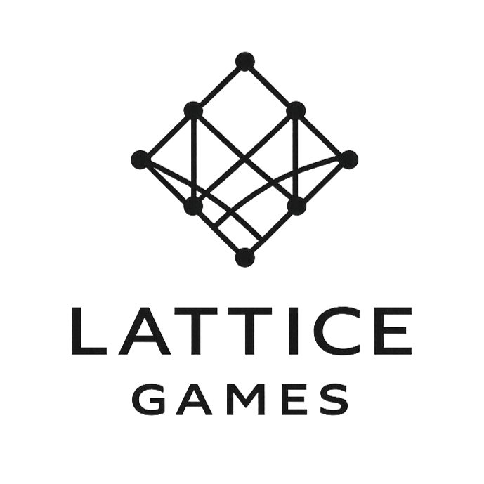

<p align="center">
  
</p>

<p align="center">
  <a href="README.md">English</a> | <a href="README.zh.md">簡體中文</a> | <a href="README.zh-Hant.md">繁體中文</a>
</p>

<p align="center">
  <a href="https://github.com/lattice-tech/concord/blob/main/LICENSE"></a>
  
  
  
</p>

# Concord Engine

Concord 是一款面向 Windows 的 C++23 即時 3D 引擎。公開 API 涵蓋渲染、場景、輸入、資產和執行階段服務。

> [!WARNING]
> Concord 仍處於早期開發階段。API、專案檔案格式和執行階段行為可能發生不相容變更，建置版本也可能不穩定。

## 能力概覽

| 範圍 | 內容 |
|---|---|
| 渲染 | Forward+ 光照、陰影、反射、後處理、雲和煙霧 |
| 執行階段 | 視窗管理、場景、輸入、事件和幀排程 |
| 內容 | 網格匯入、材質、動畫、粒子和場景序列化 |
| 工具 | 即時模式 UI、除錯工具和建置支援 |

## 快速開始

1. 下載最新的 [concord-cli](https://github.com/simalth-wang/concord-cli)。
2. 建立專案。`concord init` 會把預編譯引擎套件（DLL + 標頭檔）下載到專案的 `lib/` 和 `include/`，無需檢出引擎原始碼：

   ```sh
   concord init MyGame -v0.1.0
   cd MyGame
   concord run
   ```

3. 所有命令和選項請參閱 [concord-cli README](https://github.com/simalth-wang/concord-cli)。

## 使用範例

```cpp
#include <Concord/CApplication.h>
#include <Concord/CCamera.h>
#include <Concord/CLight.h>
#include <Concord/CObject.h>
#include <Concord/CScene.h>

int main()
{
    Concord::Game game;
    Concord::Window window({
        .title = "我的遊戲",
        .resolution = {.width = 1280, .height = 720},
        .resizable = true,
    });
    game.AttachWindow(window);

    Concord::Scene scene;
    scene.Spawn<Concord::Object::Camera>(Concord::Object::CameraDesc{
        .position = {0.0f, 2.0f, -5.0f},
        .target = {0.0f, 0.0f, 0.0f},
    });
    scene.Spawn<Concord::Object::SunLight>(Concord::Object::SunLightDesc{
        .localSolarTimeHours = 12.0f,
        .latitudeDegrees = 45.0f,
        .year = 2026,
        .month = 7,
        .day = 21,
    });
    scene.Spawn<Concord::Object::Box>(Concord::Object::BoxDesc{
        .transform = {.position = {0.0f, 1.0f, 0.0f}},
    });

    game.LoadScene(scene);
    game.Run();
}
```

## 模組

| 模組 | 公開標頭檔 | 說明 |
|---|---|---|
| 動畫 | `CAnimation.h` | 動畫片段、混合、骨骼和狀態機 |
| 應用 | `CApplication.h` | 遊戲生命週期、視窗和應用組態 |
| 音訊 | `CAudio.h` | 音訊播放、匯流排、效果鏈、合成器與 Steam Audio HRTF 空間化 |
| 攝影機 | `CCamera.h` | 攝影機節點和描述符 |
| 角色 | `CCharacter.h` | 角色控制器和組態 |
| 碰撞 | `CCollision.h` | 碰撞形狀、碰撞器和 AABB |
| 顏色 | `CColor.h` | 顏色工具 |
| 除錯 | `CDebug.h` | 日誌和除錯疊加層 |
| ECS | `CEcs.h` | 實體、元件世界、系統和命令緩衝區 |
| 特效 | `CEffects.h` | 螢幕特效和鏡頭光暈描述符 |
| 環境變數 | `CEnv.h` | 全域環境值 |
| 環境 | `CEnvironment.h` | 天空、天氣、晝夜和環境設定 |
| 事件 | `CEvents.h` | 型別化事件和視窗輸入事件 |
| 流體 | `CFluid.h` | DFSPH 流體與 Marching-Cubes 表面重建 |
| GUI | `CGUI.h` | GUI 視窗邊框與標題列樣式 |
| 輸入 | `CInput.h` | 鍵盤、滑鼠和輸入動作 |
| 互動 | `CInteraction.h` | UI 感知指標互動與射線回饋 |
| 光照 | `CLight.h` | 燈光和太陽光節點 |
| 材質 | `CMaterial.h` | 材質模型、表面和紋理 |
| 數學 | `CMath.h` | 向量、矩陣、四元數和歐拉角 |
| 運動 | `CMotion.h` | 緩動和節點運動 |
| 物體 | `CObject.h` | 可渲染場景節點和圖元 |
| 粒子 | `CParticles.h` | 粒子發射器、力場和爆發 |
| 存檔 | `CSave.h` | 場景存檔系統與歸檔序列化 |
| 場景 | `CScene.h` | 場景所有權和序列化 |
| 煙霧 | `CSmoke.h` | 局部體積煙霧節點 |
| 系統 | `CSystem.h` | 硬體和平台資訊 |
| 時間 | `CTime.h` | 時間和幀計數器 |
| UI | `CUI.h` | 即時模式 UI 和 UI 文件 |
| 工具 | `CUtils.h` | 列印和平台工具 |
| 水體 | `CWater.h` | 水體與波浪模擬 |

## 贊助

### 贊助項目

暫無。

### 贊助名單

暫無。

## 貢獻流程

見 [CONTRIBUTING.md](.github/CONTRIBUTING.md)。

<br>

<p align="center">
  
  <br>
  <sub>由 Lattice Games 開發</sub>
</p>
